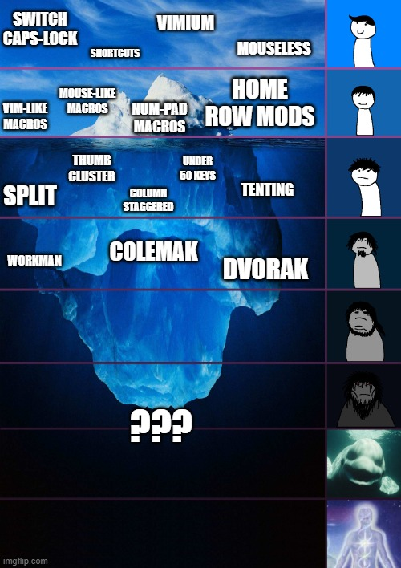
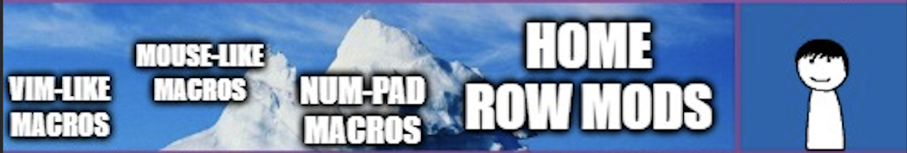
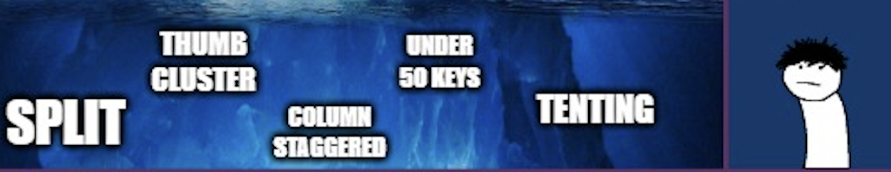
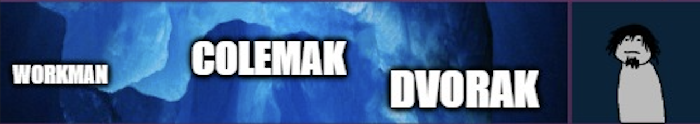

# ergonomic keyboard iceberg explained

---

# Level 1

<!--
* free and fast approach
* Why switch caps lock?
 * explain a bit finger travel distance
 * explain why caps have so good position
 * alternatives: backspace or caps
* vimium
  * show example
* mouseless
  * make it clear that you don't use it
-->

---

# Level 2

<!--
* recommended - keyboard with QMK support
* First I have to explain what is modifier key
  * let's use the simplest, well known example - shift
  * the rest should be rather easy to explain
-->
---

# My current layout 

---

# Level 3

<!--
* probably you need to built it by yourself
* split - show why not split is not natural
* thumb cluster - space rant lol ez
* tenting - explain the bones in arm
-->
---

# split keyboard

---

# VS

---

# Size matters

---

# Tenting

---

# Level 4

---

# Why default keyboard layout look like this?

---

# Why not QWERTY?

 

---

# Useful links / sources

* [Subreddit](https://www.reddit.com/r/ErgoMechKeyboards/) about ergonomic keyboards,
* A guide to [home-row mods](https://precondition.github.io/home-row-mods),
* Why [colemak](https://colemak.com/Ergonomic) is so ergonomic,
* [Vimium](https://chromewebstore.google.com/detail/vimium/dbepggeogbaibhgnhhndojpepiihcmeb) extension for chromium-based browsers,
* [Mouseless](https://mouseless.click/) - I don't use it, but looks great,
* [Great video](https://youtu.be/yiwUjLaebuw?si=ej8eK7hGe7s9U8_K) similar topic to this talk,
* My keyboard design - [SCSBAF40](https://github.com/AIn0n/scsbaf40),
* This presentation [repo](https://github.com/AIn0n/ergonomic-iceberg-explained).

---

# Thank you!

It's time for questions!
